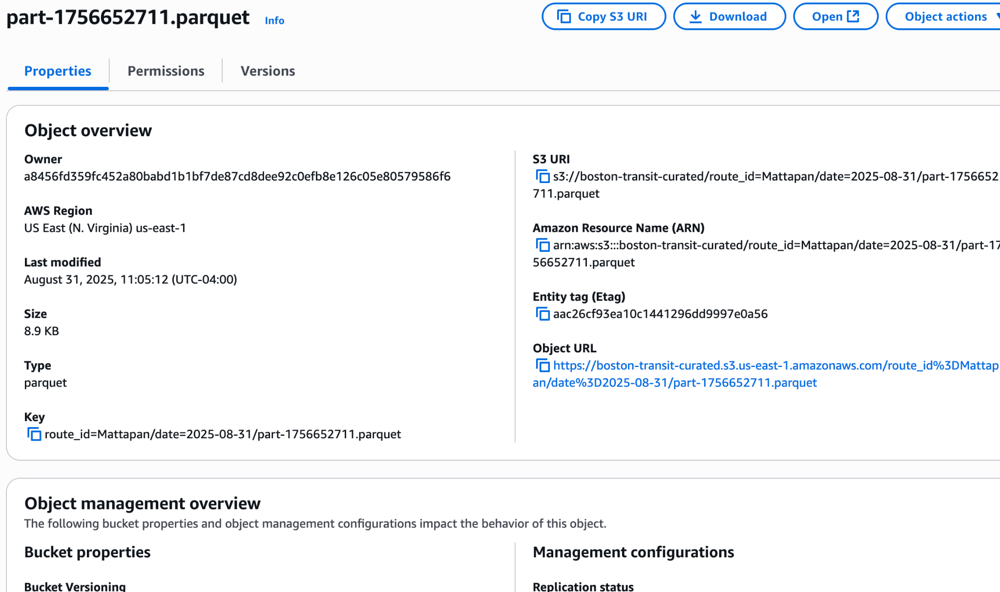
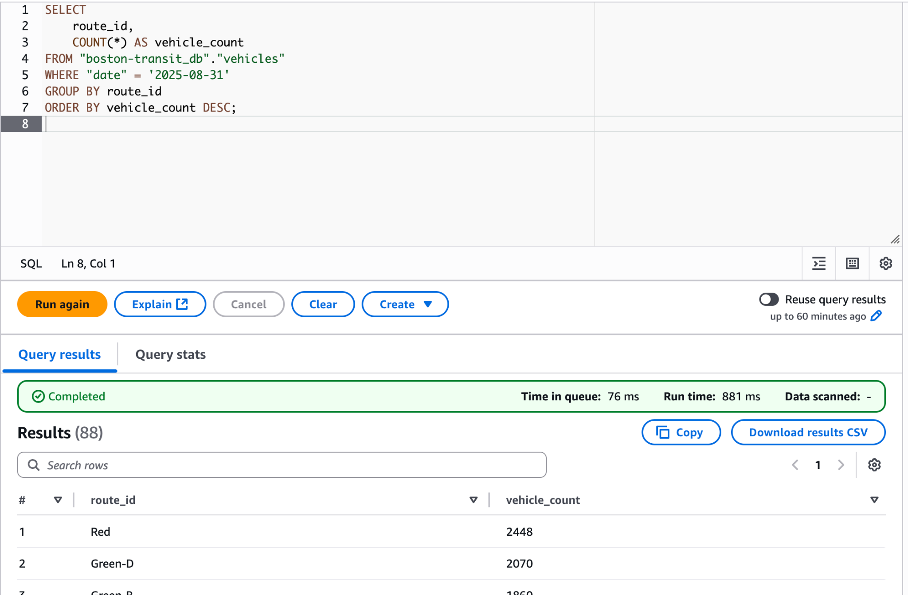

<h1 align="center">Boston Transit Data Pipeline 🚍</h1>

  <b>Serverless AWS Data Engineering Project</b> 
  <i>MBTA real-time transit data → S3 → Glue → Athena → Analytics</i>

  
  
  
  
  

# Boston Transit Data Pipeline 🚍 
 
*Serverless AWS Data Engineering Project*

An end-to-end serverless data pipeline on AWS that ingests real-time MBTA (Boston) transit data, stores it in Amazon S3, processes and normalizes it with Python Lambda functions, catalogs the data with AWS Glue, and enables SQL-based analytics in Amazon Athena.

This project mirrors a real-world data engineering workflow and demonstrates my skills in:
- AWS Serverless Architecture (Lambda, EventBridge, S3, Glue, Athena)
- ETL Pipelines (Extract → Transform → Load)
- Data Lake Design & Partitioning
- SQL Analytics with Athena
- Infrastructure as Code (Terraform)
- Automation & Scheduling with EventBridge
- Python for Data Engineering

---

## Project Architecture

MBTA API → EventBridge → Ingest Lambda → S3 (raw)  
        ↓  
Transform Lambda → S3 (curated, Parquet) → Glue Data Catalog → Athena → (Optional) QuickSight Dashboard

---

## Key Features
- Automated ingestion every 5 minutes (EventBridge → Lambda)
- Raw JSON → Curated Parquet in S3 (separate buckets)
- Serverless transformation with Python
- Partitioned data lake by route_id and date
- Glue catalog for seamless Athena SQL queries
- Scalable, cost-efficient, production-style design

---

## How It Works
1. **Data Ingestion** — `boston-transit-ingest` fetches live MBTA data and saves raw `.ndjson.gz` in S3 (raw).
2. **Transformation** — `boston-transit-transform` converts raw to Parquet and writes to S3 (curated) using partitions:
    s3://boston-transit-curated/route_id=<route>/date=<YYYY-MM-DD>/
3. **Cataloging** — AWS Glue catalogs curated Parquet for Athena.
4. **Querying** — Run SQL in Athena against the Glue table (e.g., `boston-transit_db.vehicles`).
5. **(Optional) Visualization** — Build dashboards in Amazon QuickSight.

---

## Sample Athena Query

    SELECT
        route_id,
        COUNT(*) AS vehicle_count
    FROM "boston-transit_db"."vehicles"
    WHERE "date" = '2025-08-31'
    GROUP BY route_id
    ORDER BY vehicle_count DESC;

---

## Skills Demonstrated
- **AWS Services:** Lambda, S3, Glue, Athena, EventBridge, IAM
- **Programming:** Python for API integration & ETL
- **Data Formats:** JSON → Parquet, partitioned data lake
- **SQL Analytics:** Athena over S3
- **IaC:** Terraform for repeatable deployments
- **Serverless:** Low-cost, scalable, event-driven

---

## Optional Enhancements (Future Work)
- Real-time streaming with Amazon Kinesis
- Alerts & monitoring via Amazon SNS
- QuickSight dashboards for KPIs (on-time %, delays)
- Data quality checks before Parquet conversion
- S3 lifecycle rules for cost optimization

---

---

## License
MIT

[def]: https://github.com/johnmiller-lovescode/boston-transit-data-pipeline/actions/workflows/deploy.yml/badge.svg

---

## 📸 Project Screenshots

### 1. Curated Parquet Files in S3

### 2. Athena Query Results

