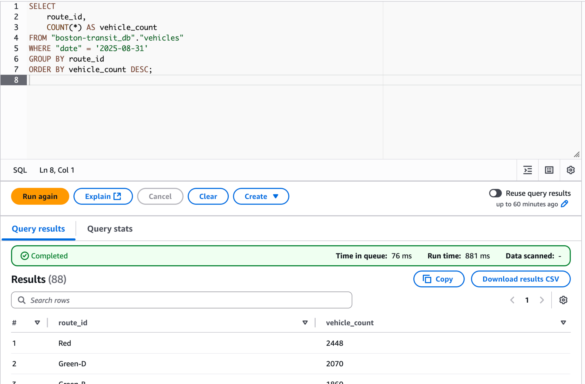
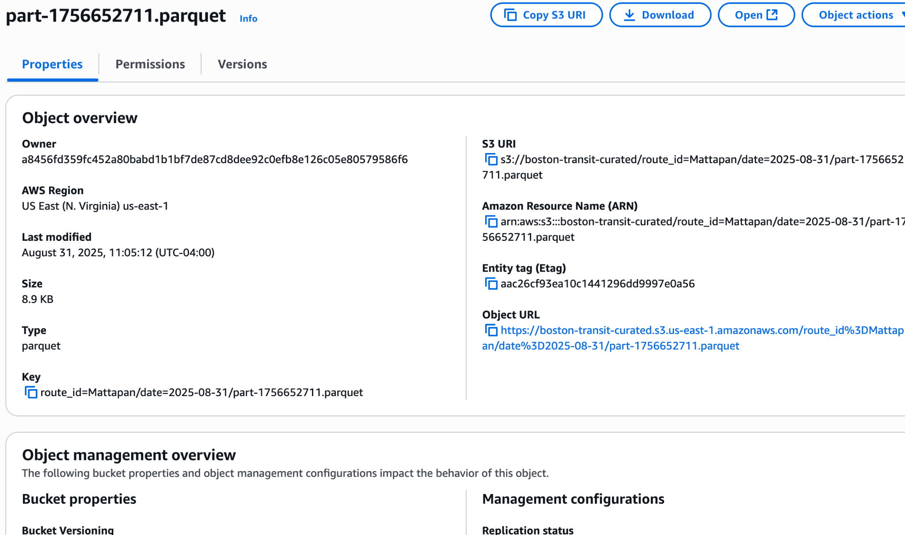

<h1 align="center">Boston Transit Analytics 🚇</h1>

<p align="center">
  <b>Serverless AWS Data Engineering & Analytics Project</b><br>
  <i>Real-time MBTA data → AWS serverless pipeline → Athena → Interactive dashboard</i>
</p>

<p align="center">
  
  
  
  
  
</p>

<p align="center">
  
</p>

## Overview

Boston Transit Analytics is an end-to-end cloud data engineering project that collects MBTA vehicle-position data, processes it through a serverless AWS pipeline, stores analytics-ready Parquet data in Amazon S3, queries it with Amazon Athena, and presents the results in an interactive Python dashboard.

The project demonstrates how raw public API data can be transformed into a queryable cloud data lake and then surfaced through an application designed for exploration and analysis.

## Architecture

```text
MBTA API
   │
   ▼
Amazon EventBridge
   │
   ▼
Ingest Lambda
   │
   ▼
Amazon S3 (Raw NDJSON/GZIP)
   │
   ▼
Transform Lambda
   │
   ▼
Amazon S3 (Curated Parquet)
   │
   ▼
AWS Glue Data Catalog
   │
   ▼
Amazon Athena
   │
   ▼
Streamlit + PyDeck Dashboard
```

Infrastructure is managed with Terraform.

## Interactive Analytics Dashboard

The project includes an interactive Streamlit dashboard built on top of processed MBTA vehicle data.

Dashboard features include:

- Interactive geographic visualization of vehicle positions
- Route filtering
- Official MBTA route names and colors
- Vehicle and route summary metrics
- Vehicle counts by route
- Interactive map tooltips
- Human-readable vehicle status information
- Searchable tabular vehicle data
- MBTA API metadata enrichment
- PyDeck-based map visualization

The dashboard connects the data-engineering pipeline to a usable analytics interface rather than stopping at raw SQL results.

## Data Pipeline

### 1. Ingestion

A Python AWS Lambda function retrieves vehicle-position data from the MBTA API.

Amazon EventBridge schedules the ingestion process automatically.

Raw responses are compressed and stored in the raw S3 data lake as NDJSON/GZIP files.

### 2. Transformation

A second Lambda function reads the raw records and normalizes fields including:

- Vehicle ID
- Route ID
- Vehicle label
- Latitude
- Longitude
- Speed
- Bearing
- Current status
- Update timestamp

The transformed records are written as compressed Apache Parquet.

### 3. Partitioning

Curated data is organized using route and date partitions:

```text
route_id=<route>/date=<YYYY-MM-DD>/
```

This layout allows Athena to limit the amount of S3 data scanned for partition-aware queries.

### 4. Cataloging and Analytics

AWS Glue provides the data catalog used by Amazon Athena.

Athena can query the curated Parquet data directly from S3 using SQL without provisioning a database server.

### 5. Visualization

Athena query results can be exported into the Streamlit analytics application.

The dashboard enriches route IDs using MBTA route metadata and displays vehicle positions with official route colors using PyDeck.

## Technology Stack

| Area | Technology |
|---|---|
| Cloud | AWS |
| Infrastructure as Code | Terraform |
| Compute | AWS Lambda |
| Scheduling | Amazon EventBridge |
| Data Lake | Amazon S3 |
| Data Catalog | AWS Glue |
| Analytics | Amazon Athena |
| ETL | Python, pandas, PyArrow |
| Storage Format | Apache Parquet |
| Dashboard | Streamlit |
| Mapping | PyDeck |
| External Data | MBTA API |
| Version Control / CI | GitHub / GitHub Actions |

## Sample Athena Query

```sql
SELECT
    route_id,
    COUNT(*) AS vehicle_count
FROM "boston-transit_db"."vehicles"
WHERE "date" = '2025-08-31'
GROUP BY route_id
ORDER BY vehicle_count DESC;
```

## Repository Structure

```text
boston-transit-data-pipeline/
├── .github/
├── assets/
├── dashboard/
│   ├── app.py
│   ├── requirements.txt
│   └── vehicle_positions.csv
├── samples/
│   └── athena_samples.sql
├── src/
│   ├── ingest_lambda/
│   │   ├── app.py
│   │   └── requirements.txt
│   └── transform_lambda/
│       ├── app.py
│       └── requirements.txt
├── terraform/
├── architecture.png
├── LICENSE
└── README.md
```

## Running the Dashboard Locally

Create and activate a Python virtual environment:

```bash
python3 -m venv .venv
source .venv/bin/activate
```

Install the dashboard dependencies:

```bash
pip install -r dashboard/requirements.txt
```

Start Streamlit:

```bash
python -m streamlit run dashboard/app.py
```

Streamlit will provide a local URL for the dashboard.

## Skills Demonstrated

This project demonstrates practical experience with:

- Designing a serverless AWS data pipeline
- Building Python ETL workloads
- Integrating external REST APIs
- Designing an S3-based data lake
- Transforming JSON into columnar Parquet
- Partitioning analytical datasets
- Querying cloud data with Athena SQL
- Working with the AWS Glue Data Catalog
- Infrastructure as Code with Terraform
- Event-driven automation with EventBridge
- Building interactive analytics applications
- Geographic data visualization with PyDeck
- Integrating MBTA metadata into an analytics interface
- Git and GitHub-based development workflows

## Potential Future Enhancements

- Automatically query Athena from the dashboard instead of using an exported dataset
- Add historical vehicle-position analysis
- Add route-level performance metrics
- Add automated data-quality validation
- Add CloudWatch monitoring and alerting
- Add S3 lifecycle policies
- Deploy the dashboard publicly

## Screenshots

### Athena Query Results



### Curated Parquet Data



## License

MIT